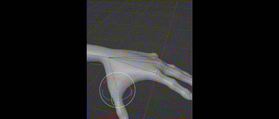

# Blender
## Information
- Version: 4+
- Programming: Python using Blender API only
- Network: ZMQ, UDP, or WS

## Setup Instructions
1. Install Blender
   - Download the latest stable version from: https://www.blender.org/download/
   - Note: Blender supports all major platforms (Windows, macOS, and Linux)
   - The Python interpreter comes bundled with the Blender installation
2. Familiarize yourself with Blender Python (bpy)
   - Start with the quickstart guide: https://docs.blender.org/api/current/info_quickstart.html#before-starting
   - This guide will help you understand:
     - Python console usage in Blender
     - Basic script execution
     - Object manipulation
     - Animation control
3. Study the API Documentation
   - Reference: https://docs.blender.org/api/current/info_overview.html
   - Focus on these key areas:
     - Object creation and manipulation
     - Property access and modification
     - Animation system
     - Data blocks and scene management
     - Custom property handling
     - Event handling system
4. Implement FEAGI Controller
   - Access the controller documentation: https://github.com/feagi/controllers/blob/main/README.md
   - You will need to develop code that:
     - Interfaces with Blender's Python API
     - Processes FEAGI signals into Blender commands
     - Sends object/scene data back to FEAGI

## Controller
Boilerplates are provided. A controller requires capabilities, networking, requirements.txt, and version specifications.

## Libraries
Feagi-connector is the library that enables communication with the brain (FEAGI). We need to create a controller for Blender.

## Troubleshooting
- Join our [Discord community](https://discord.gg/GxHXvY79) to chat with other users and ask questions
- If you encounter issues building the controller, please create an issue in the repository

# Goal for this project
Ultimately, the goal of this project is to build a controller that enables FEAGI to fully control the Blender character, its animations, and the sensors it reads, such as the object's gyroscope and pose, in real time. 

Below is where you can try and start step by step:
- Control the hand using FEAGI. See the example at the bottom, which is similar to the second video.
  Official Blender animation example showing manual hand movement:

  

    - Here is a video of FEAGI controlling the robotic hand (3:37 to 3:46):
https://youtu.be/u8Lw8djFQAY?t=217

    - Another example from 0:00 to 0:05:
https://www.youtube.com/watch?v=1ND9Sw5MaIk

The goal is to enable FEAGI to move any object in Blender, such as arms, eyes, eyebrows, hands, fingers, etc.

- FEAGI should have the capability to rig objects automatically. See this example from Blender:

- FEAGI should be able to update animation keyframes

- The end goal should look similar to this. You don't need to worry about the webcam - focus only on how FEAGI controls Blender.
See an example of the ideal result:

Here’s a complete table comparing **Blender** and **Gazebo** terminology for a **robot arm simulation**, covering all possible features.

| **Feature**         | **Blender Term** | **Gazebo Term** |
|---------------------|----------------|----------------|
| **General Structure** |  |  |
| Model of the Robot | Mesh (Object) | SDF/URDF Model |
| Hierarchical Structure | Parent-Child Relationship | Link-Tree Hierarchy |
| Movement Units | Bones (in Armature) | Links (Rigid Bodies) |
| Pivot/Joint Position | Bone Head/Tail | Joint Anchor/Axis |
| **Joints & Motion** |  |  |
| Joint (Movable Connection) | Bone with Constraints | Joint (Revolute, Prismatic, etc.) |
| Joint Rotation | Bone Rotation | Joint Angle (Position) |
| Joint Translation | Bone Scale (Rarely Used) | Prismatic Joint |
| Joint Limits | IK Constraints/Transform Constraints | Joint Limits (Lower/Upper Bound) |
| Inverse Kinematics (IK) | IK Solver (Bone Constraint) | ROS MoveIt! (IK Solver) |
| **Physics & Simulation** |  |  |
| Physics Engine | Bullet (Blender Physics) | ODE, Bullet, Simbody, DART |
| Rigid Body Dynamics | Rigid Body Simulation | Link with Inertia |
| Collision Detection | Collision Meshes | Collision Elements |
| Mass Properties | Rigid Body Mass Settings | Link Mass & Inertia |
| Gravity | Scene Gravity | Gazebo World Gravity |
| **Sensors & Perception** |  |  |
| Cameras | Camera Object | Camera Sensor |
| LIDAR | Point Cloud Render Hacks | LIDAR Sensor Plugin |
| Force/Torque Sensor | Physics Constraints & Drivers | Force/Torque Sensor |
| Contact Sensor | Rigid Body Collisions | Contact Sensor Plugin |
| **Control & Actuation** |  |  |
| Actuator Control | Drivers & Animation Keyframes | Joint Controllers (PID) |
| Motor Torque | Rigid Body Forces | Effort Control |
| Joint Velocity | Animation Curves | Velocity Controllers |
| ROS Integration | Python Scripting (Limited) | ROS Topics & Services |
| Path Planning | Animation Paths & Constraints | MoveIt! Path Planning |
| **Rendering & Visualization** |  |  |
| Texturing & Materials | Shader Nodes / Principled BSDF | Gazebo Materials (SDF) |
| Lighting | Point, Spot, Area, Sun | Light Source Plugin |
| Environment | World Settings | Gazebo World (SDF) |
| **Programming & Automation** |  |  |
| Python Scripting | Blender API (bpy) | Gazebo Plugins (C++/Python) |
| Animation Control | Graph Editor & NLA | ROS & Gazebo Controllers |
| Custom Plugins | Custom Operators & Add-ons | Gazebo Plugins & ROS Nodes |
