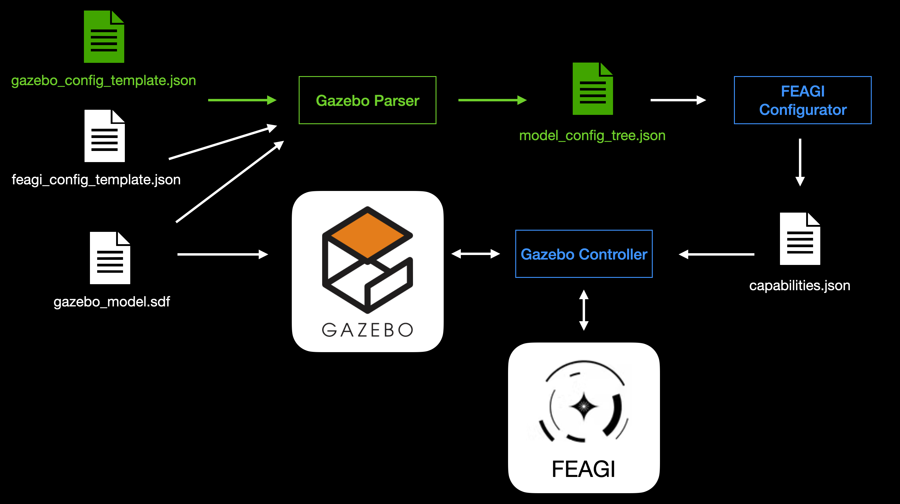

# Gazebo Parser

This README provides an overview of the **Gazebo Parser**, a tool designed to read any **SDF (Simulation Description Format)** file and convert it into a structured configuration (`model_config_tree.json`). The parser facilitates the translation between **Gazebo** and **FEAGI** capabilities while maintaining a ground truth for sensors and actuators. Additionally, it generates a necessary config without requiring extra manual work.  

This document explains the parser's role, its relationship with other components (such as the **Gazebo controller** and **FEAGI configurator**), and how it processes configuration templates. By following this guide, users will understand how the parser integrates with Gazebo and FEAGI, ensuring flexibility and compatibility with various SDF files.  

## Information
- Version: gz only
- Programming: sdf, python

# Set up instructions  
There are three different ways to install Gazebo. Fortunately, Gazebo supports all platforms. The Windows OS has a slightly unique setup for installing Gazebo since it uses WSL, which is essentially a Linux environment. So, technically, you are only installing Gazebo on Linux or Mac.

## Windows 11 set up
- wsl --install
- sudo apt-get update
- sudo apt-get install curl lsb-release gnupg
- sudo curl https://packages.osrfoundation.org/gazebo.gpg --output /usr/share/keyrings/pkgs-osrf-archive-keyring.gpg
- echo "deb [arch=$(dpkg --print-architecture) signed-by=/usr/share/keyrings/pkgs-osrf-archive-keyring.gpg] http://packages.osrfoundation.org/gazebo/ubuntu-stable $(lsb_release -cs) main" | sudo tee /etc/apt/sources.list.d/gazebo-stable.list > /dev/null
- sudo apt-get update
- sudo apt-get install gz-harmonic

## Mac (Apple Silicon)
- ulimit -n unlimited 
- /bin/bash -c "$(curl -fsSL https://raw.githubusercontent.com/Homebrew/install/master/install.sh)" 
- brew tap osrf/simulation
- brew install gz-ionic

# Linux (24.04)
- sudo apt-get update
- sudo apt-get install lsb-release gnupg
- sudo curl https://packages.osrfoundation.org/gazebo.gpg --output /usr/share/keyrings/pkgs-osrf-archive-keyring.gpg
- echo "deb [arch=$(dpkg --print-architecture) signed-by=/usr/share/keyrings/pkgs-osrf-archive-keyring.gpg] http://packages.osrfoundation.org/gazebo/ubuntu-stable $(lsb_release -cs) main" | sudo tee /etc/apt/sources.list.d/gazebo-stable.list > /dev/null
- sudo apt-get update
- sudo apt-get install gz-ionic

# Goal for this project
The parser should be able to read any SDF and convert it into a `model_config_tree.json`, which contains the translation between Gazebo and FEAGI capabilities, as well as the UI. The parser should also maintain a separate ground truth for sensors and actuators in both Gazebo and FEAGI. Additionally, it is designed to build capabilities and provide a UI view, allowing users to visualize the model without requiring any extra work.  

See the diagram here:  
  

The Gazebo controller is not part of this directory. This directory focuses solely on the Gazebo parser, which is highlighted in green in the diagram. The FEAGI configurator, Gazebo, and the Gazebo controller are outside the scope of the Gazebo parser.  

The Gazebo config template JSON is largely similar to this design:  
[template.json](../../../embodiments/template/template.json)  

The Gazebo config template will be high-level and should support both input and output, handling multiple types of sensor and actuator data.  

Once the Gazebo parser reads the Gazebo config template, it will process the Gazebo model, create a tree (i.e., a dictionary), and pass it to a new file called `model_config_tree.json`. The FEAGI configurator will then use this file to generate the necessary files for the Gazebo controller. None of the files should be hardcoded, and the parser should work with all types of SDF files.

# Setting up the Gazebo Parser
    create a new python virtual environment by running `python3 -m venv C:\path\to\new\virtual\environment`
    enter the virtual environment by running `source venv/bin/activate`
    install all required dependencies by running `python3 -m pip install -r requirements.txt`
    
    $_{Our parser only requires the lxml module to run, virtual environments are optional}$

    CMD LINE USAGE :
    1 - python config_parser.py <target.sdf> 

       * Uses default gazebo config : 'gazebo_config_template.json'*
       * Uses default feagi config : 'feagi_config_template.json'*

    2 - python config_parser.py <target.sdf> <gazebo_config.json> <feagi_config.json> 

    the parser automatically outputs to 'model_config_tree.json' this can then be loaded into the feagi configurator
