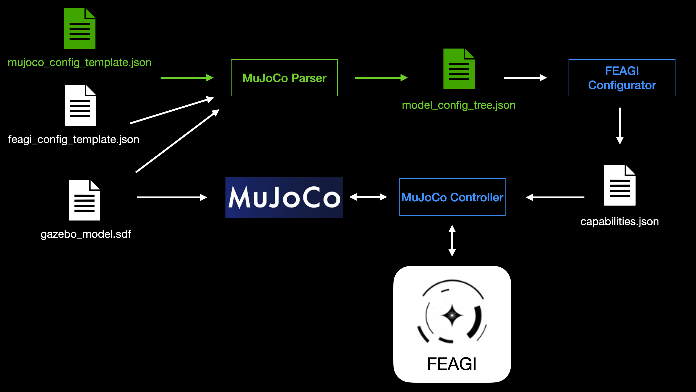

# Mujoco Parser
This README provides an overview of the **Mujoco Parser**, a tool designed to read any **XML (MuJoCo Model XML)** file and convert it into a structured configuration (`model_config_tree.json`). The parser facilitates the translation between **MuJoCo** and **FEAGI** capabilities while maintaining a ground truth for sensors and actuators. Additionally, it generates a necessary config without requiring extra manual work.

This document explains the parser's role, its relationship with other components (such as the **MuJoCo controller** and **FEAGI configurator**), and how it processes configuration templates. By following this guide, users will understand how the parser integrates with MuJoCo and FEAGI, ensuring flexibility and compatibility with various MuJoCo XML model files.

Here is the diagram:




# Using the Config Parser Library

## Quick Start
```python
import config_parser

# Generate config of json from your XML file
config = config_parser.xml_to_config('your_model.xml')
```

## Overview
The Config Parser Library provides a simple way to convert MuJoCo XML model files into `model_config_tree.json`. 
## Usage
1. Import the library in your Python script
2. Call the `xml_to_config()` function with your XML filename
3. The function returns a `model_config_tree.json`